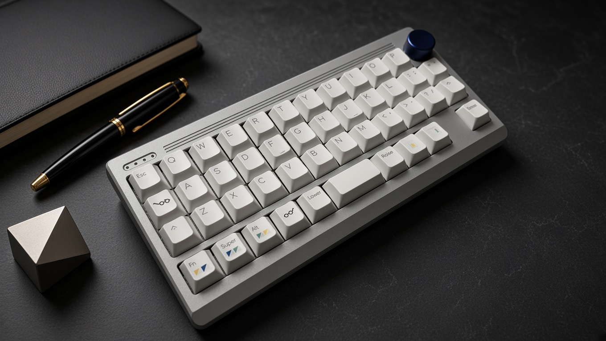
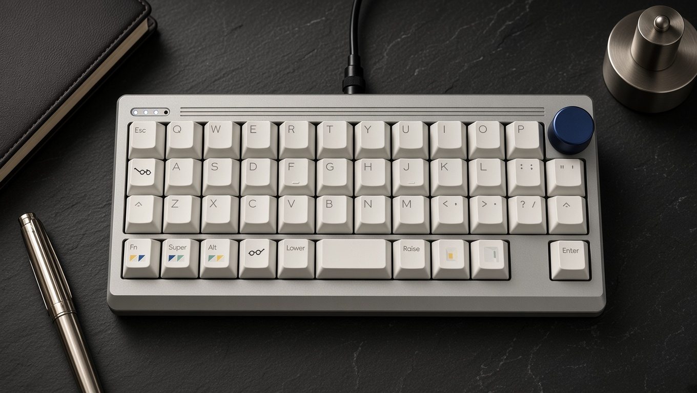

# Ostinato



A custom 40% ortholinear mechanical keyboard designed from the ground up.

Ostinato is a compact 45-key ortholinear keyboard featuring a custom PCB, aluminum case, gasket-mounted plate, rotary encoder, RGB status indicators, and hybrid USB/Bluetooth connectivity.

The project includes the complete hardware and firmware design, from the PCB and case to the QMK/Vial firmware and ESP32-C3 Bluetooth controller.

---

## Features

- 40% ortholinear layout
- 45 keys
- MX-compatible switches
- QMK firmware
- Vial support
- USB and Bluetooth connectivity
- ESP32-C3-based Bluetooth controller
- RP2040-based main controller
- Three Bluetooth connection slots
- Rotary encoder
- SK6812MINI RGB LEDs
- Dedicated Bluetooth status indicators
- Layer status indication
- Gasket-mounted plate
- Custom aluminum top case
- MJF PA12S nylon bottom case
- Stainless steel or H59 Copper alloy Brass internal weight

---

## Specifications

| Specification | Details |
|---|---|
| Layout | 40% Ortholinear |
| Keys | 45 |
| Main MCU | RP2040 |
| Bluetooth MCU | ESP32-C3 |
| Firmware | QMK |
| Keymap Configuration | Vial |
| Connectivity | USB / Bluetooth |
| Bluetooth Slots | 3 |
| Switch Type | MX-compatible |
| RGB LEDs | SK6812MINI (4x) |
| Rotary Encoder | 1 |
| Mounting | Gasket mount (Poron) |
| Plate | PC |
| Top Case | 6061 Aluminum |
| Bottom Case | MJF PA12S Nylon |
| Internal Weight | SUS304 Stainless steel or H59 Copper alloy Brass |

---

## Layout

Ostinato uses a compact 40% ortholinear layout with 45 keys.

The layout is designed around multiple layers to provide the functionality of a full-size keyboard while maintaining a small footprint.

### Layers

The firmware includes the following primary layers:

- **Base**
- **Navigation**
- **Number / Symbol**
- **Function**
- **Gaming**
- **Gaming+**
- **Gaming Navigation**

Additional layers and key assignments can be configured through Vial.

---

## Connectivity

Ostinato supports both wired USB and Bluetooth operation.

The RP2040 handles the primary keyboard functionality, while an ESP32-C3 module provides Bluetooth connectivity.

### USB

In USB mode, the keyboard operates as a standard USB HID keyboard.

### Bluetooth

The keyboard supports three Bluetooth connection slots:

- **Bluetooth 1**
- **Bluetooth 2**
- **Bluetooth 3**

The active Bluetooth slot can be selected directly from the keyboard. The firmware communicates with the ESP32-C3 over UART to control Bluetooth connection state and slot selection.

---

## Bluetooth Status

The RGB LEDs are used to provide visual feedback for Bluetooth status. Each Bluetooth slot has a dedicated status indicator.

The indicators distinguish between states such as:

- Advertising
- Connected
- Pairing
- Error / unavailable

This allows the current Bluetooth connection state to be checked without using a host device.

---

## RGB Indicators

Ostinato uses four SK6812MINI RGB LEDs. The LEDs are used as functional status indicators rather than decorative backlighting.

### Bluetooth Indicators

Three LEDs indicate the status of the three Bluetooth slots.

### Layer Indicator

The remaining LED is used for layer/status indication. The firmware can also use the indicator to display the state of special keyboard functions.

---

## Rotary Encoder

Ostinato includes a rotary encoder for additional input.

The encoder can be configured through QMK and Vial and can be assigned different functions depending on the active layer.

---

## Architecture & Design Philosophy

The goal of Ostinato is to combine a compact ortholinear layout with functionality normally associated with larger keyboards.

Rather than relying on a single wireless controller, the design separates the main keyboard controller and Bluetooth controller:

```text
       ┌───────────────┐
       │    RP2040     │
       │ Main Keyboard │
       │  Controller   │
       └───────┬───────┘
               │
              UART
               │
       ┌───────▼───────┐
       │   ESP32-C3    │
       │   Bluetooth   │
       │  Controller   │
       └───────────────┘
```

This architecture allows the RP2040 to remain responsible for the core keyboard operations (matrix scanning, lighting, Vial configuration) while the ESP32-C3 handles the Bluetooth connectivity stack.

---

## Firmware

The firmware is based on [QMK](https://qmk.fm/) and includes [Vial](https://get.vial.today/) support.

```text
firmware/
├── esp32-c3/
├── qmk/
│   └── ostinato/
└── vial/
    └── ostinato/
```

- **QMK Firmware**: Handles matrix scanning, keymaps and layers, custom keycodes, rotary encoder, RGB status indicators, USB output, and UART communication with the ESP32-C3.
- **ESP32-C3 Firmware**: Handles Bluetooth profile management, connection slots, and wireless HID output.

### Custom Keycodes

Ostinato defines custom keycodes for output and connection control:

- `OUT_USB`
- `OUT_BT1`
- `OUT_BT2`
- `OUT_BT3`
- `BT_CLR`

These keycodes allow switching between USB and the three paired Bluetooth devices on the fly.

---

## Hardware

The hardware is divided into modular custom boards:

```text
pcb/
├── main-module/
├── led_module/
└── knob-module/
```

- **Main Module**: Hosts the RP2040 controller, ESP32-C3, diode matrix, and power regulation.
- **LED Module**: Contains four SK6812MINI addressable RGB LEDs for slot and layer visualization.
- **Knob Module**: Houses the rotary encoder and its breakout interface.

### Case & Plate

- **Top Case**: CNC-machined 6061 aluminum
- **Bottom Case**: MJF 3D-printed PA12S nylon
- **Internal Weight**: Laser-cut SUS304 Stainless steel or H59 Copper alloy Brass
- **Mounting**: Custom Poron gasket strips isolating the PC plate for a soft, resonant bottom-out.

Plate cutting profiles are provided in DXF format under `plate/`:
- `design.dxf`
- `plate.dxf`

---

## Repository Structure

```text
ostinato/
├── case/             # CAD and step/stl files for case parts
├── firmware/
│   ├── esp32-c3/     # ESP-IDF / Arduino BT firmware
│   ├── qmk/          # QMK source and keyboard rules
│   │   └── ostinato/
│   └── vial/         # Vial configuration & keymap files
│       └── ostinato/
├── pcb/
│   ├── main-module/  # Schematic, KiCad layouts, and Gerber files
│   ├── led_module/
│   └── knob-module/
├── plate/
│   ├── design.dxf
│   └── plate.dxf
└── README.md
```

---

## Status

Ostinato is an active custom hardware project. Schematics, gerber files, and firmware implementations may receive breaking updates as physical revisions are tested.

---

## Credits

Designed and developed by **sky2park**.

- [QMK Firmware](https://qmk.fm/)
- [Vial](https://get.vial.today/)
- Raspberry Pi RP2040 & Espressif ESP32-C3

---

## License

License information will be added later.



